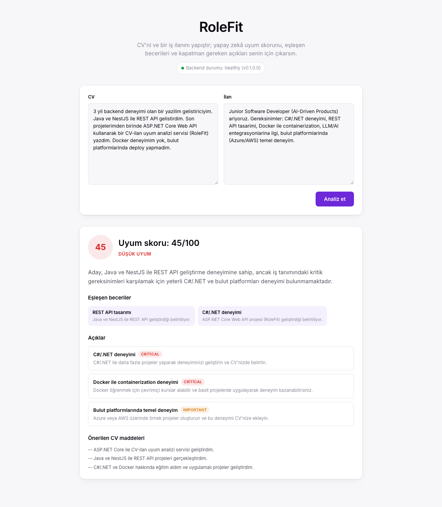
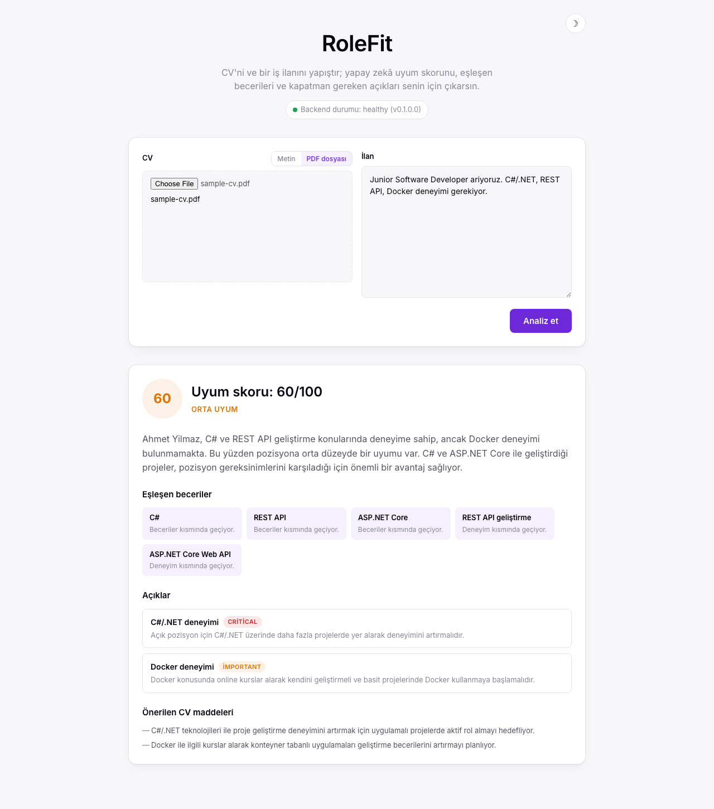
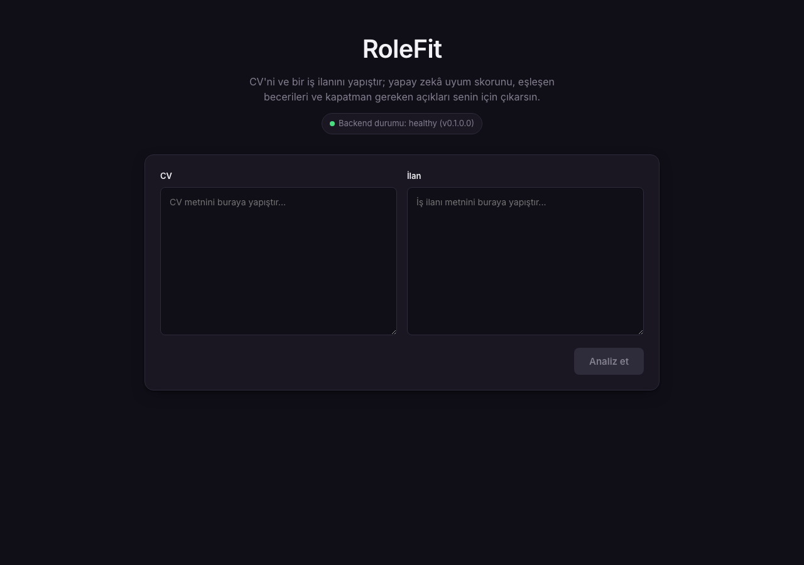

# RoleFit

RoleFit, bir CV ile bir iş ilanının ne kadar uyumlu olduğunu analiz eden
yapay zekâ destekli bir servistir. Bir CV (metin veya PDF) ve bir ilan metni
verirsin; OpenAI'ı yapılandırılmış çıktı üretmeye zorlayan çok adımlı bir
analiz akışı çalışır ve sana genel bir uyum skoru, eşleşen beceriler
(kanıtıyla), açıklar (önem derecesi ve somut öneriyle) ve role göre kısa bir
konumlandırma özeti döner.

ASP.NET Core Web API (backend) + Vite/React/TypeScript (frontend) olarak
full-stack yazıldı.



## Bu proje ne değil

- Canlıya deploy edilmiş bir servis değil — **sadece lokalde çalıştırılmak
  üzere** yazıldı, şu an public bir demo linki yok.
- Tam bir ATS ya da işe alım platformu değil.
- Kullanıcı hesabı / auth yok.
- Analiz geçmişi kaydedilmiyor (kalıcılık katmanı henüz eklenmedi).

## Özellikler

- **Metin veya PDF olarak CV girişi.** PDF'ten metin çıkarımı [PdfPig](https://github.com/UglyToad/PdfPig) ile yapılır.
- **Yapılandırılmış çıktı:** OpenAI Chat Completions, `response_format: json_schema` (strict) ile şemaya zorlanır — serbest metin değil, makinece güvenilir parse edilebilir bir sonuç.
- **Çok adımlı (agentic) analiz akışı:** (1) CV'den aday becerileri çıkarılır, (2) ilandan rol gereksinimleri çıkarılır, (3) ikisi karşılaştırılıp skorlanır, açıklar ve öneriler üretilir.
- **Sağlamlık:** geçici sağlayıcı hatalarında (429/5xx/timeout) backoff'lu retry; sağlayıcı hatası veya parse edilemeyen çıktı isteği çökertmez, temiz bir `502` döner.
- **Light/dark tema**, manuel tema değiştirme düğmesiyle.

## Teknoloji yığını

- **Backend:** ASP.NET Core Web API (.NET 10), Swashbuckle/Swagger, `IHttpClientFactory` ile tipli bir OpenAI istemcisi, PdfPig.
- **Frontend:** Vite + React + TypeScript, sade React state (ekstra state kütüphanesi yok).
- **LLM:** OpenAI (`gpt-4o-mini`, config'ten değiştirilebilir).
- **Testler:** Backend xUnit (19 test), frontend Vitest + React Testing Library (8 test).

## Mimari (kısaca)

```
İstek → AnalyzeController → IFitAnalyzer (FitAnalyzer)
                                   │
                        3 adımlı orkestrasyon
                                   │
                              ILlmClient (OpenAiLlmClient)
                                   │
                          OpenAI Chat Completions
                       (response_format: json_schema)
```

`ILlmClient` sağlayıcıyı soyutlar (ileride başka bir LLM sağlayıcısına
geçmek `FitAnalyzer`'a dokunmadan mümkün olsun diye);
`IFitAnalyzer`/`FitAnalyzer` prompt kurma, çok adımlı orkestrasyon ve
savunmacı JSON parse işini üstlenir.

## Lokalde çalıştırma

Gereksinimler: [.NET 10 SDK](https://dotnet.microsoft.com/download), Node.js 18+.

### 1. Backend

```bash
# OpenAI API anahtarını user-secrets'a kaydet (repoya asla girmez)
dotnet user-secrets set "Llm:ApiKey" "<openai-key>" --project src/RoleFit.Api

dotnet run --project src/RoleFit.Api
```

Backend `http://localhost:5153` üzerinde ayağa kalkar; Swagger UI
`http://localhost:5153/swagger` adresinde açılır.

### 2. Frontend

```bash
cd web
npm install
npm run dev
```

`http://localhost:5173` (veya Vite'ın seçtiği başka bir port) üzerinden
arayüze ulaşılır; `/api` ve `/health` istekleri dev proxy ile backend'e
yönlendirilir (bkz. `web/vite.config.ts`).

### Testler

```bash
dotnet test                 # backend, xUnit
cd web && npm run test       # frontend, Vitest + RTL
```

## API

| Endpoint | Açıklama |
|---|---|
| `GET /health` | Durum, versiyon ve UTC zaman bilgisi döner. |
| `POST /api/analyze` | `{ cvText, jobDescription }` alır, `FitResult` döner. Boş girdi → `400`. |
| `POST /api/analyze/pdf` | `multipart/form-data`: `cvFile` (PDF) + `jobDescription`. Geçersiz/bozuk/aşırı büyük dosya → `400`. |

Sağlayıcı hatası veya parse edilemeyen LLM çıktısı her iki endpoint'te de
`502` (RFC 9110 problem details) olarak döner; istek çökmez.

## Ekran görüntüleri

| Analiz sonucu | PDF yükleme |
|---|---|
|  |  |

Koyu tema:




